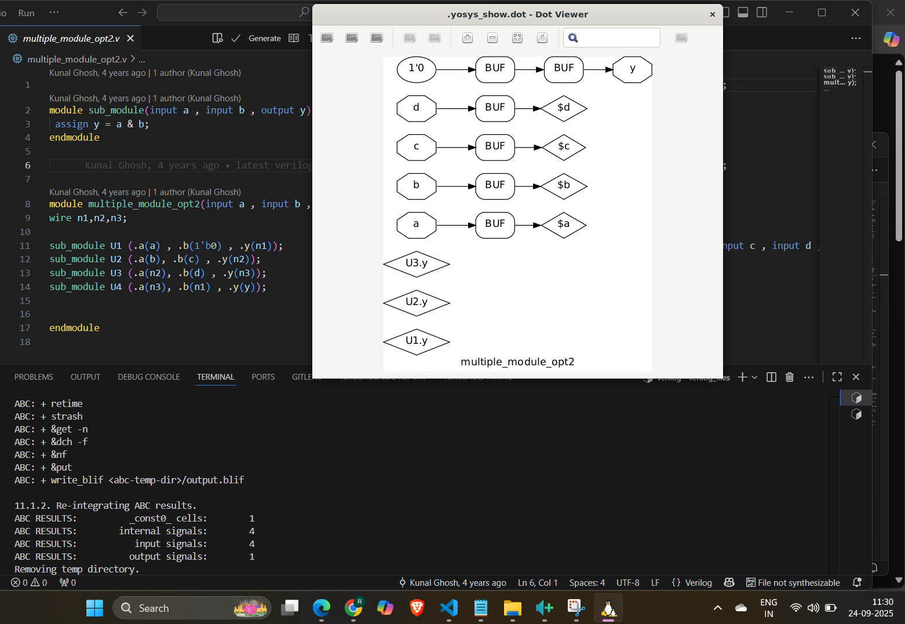

 
# 🚀 Week1  RTL-GLS 

Got it 👍 Let’s make this **Task 1 report more engaging, visual, and story-like** so it doesn’t look flat or boring.

Here’s a polished version ⬇️

---

# 🚀 Task 1 – Yosys Optimization with `opt_clean -purge`

## 🎯 Objective

Explore how **Yosys** uses the `opt_clean -purge` command to **sweep away redundant wires, cells, and dead logic**, leaving behind a clean, efficient design.

---

## 🛠️ Flow & Commands

| Step | Command                                                             | Purpose                              |
| ---- | ------------------------------------------------------------------- | ------------------------------------ |
| 1️⃣  | `read_liberty -lib ../my_lib/lib/sky130_fd_sc_hd__tt_025C_1v80.lib` | Load standard cell library           |
| 2️⃣  | `read_verilog opt_check4.v`                                         | Load RTL design                      |
| 3️⃣  | `synth -top opt_check4`                                             | Run synthesis                        |
| 4️⃣  | `opt_clean -purge`                                                  | ✨ Remove unused nets, dangling cells |
| 5️⃣  | `abc -liberty ../my_lib/lib/sky130_fd_sc_hd__tt_025C_1v80.lib`      | Map to technology cells              |
| 6️⃣  | `show`                                                              | View netlist visually                |

👉 Repeated same flow for `multiple_module_opt.v`.

---

## 📊 Results

📌 **Case 1 – opt\_check4.v**

* ✅ After optimization, the new netlist (`opt_check4_net.v`) looks **much cleaner**, with unnecessary wires removed.


---

📌 **Case 2 – multiple\_module\_opt.v**

* ⚡ Before optimization → Netlist contained **extra redundant connections**.
* ✂️ After `opt_clean -purge` → Design became **simpler, faster, and easier to read**.

| Stage                      | Netlist Snapshot                                                                          |
| -------------------------- | ----------------------------------------------------------------------------------------- |
| Without `opt_clean -purge` |  |
| With `opt_clean -purge`    |                               |

---

## 🧠 Key Takeaways

* 🗑️ `opt_clean -purge` = **Garbage collector** for Yosys netlists.
* 🚦 Removes unused nets, floating signals, and redundant cells.
* 🎯 Leads to **smaller, faster, and easier-to-debug circuits**.
* 🔧 Especially useful when working with **multi-module designs** where intermediate wires are left unused.

---

✨ **In short**:
Think of `opt_clean -purge` as a **vacuum cleaner** for your design.
It sweeps away all the dust (redundant logic) so only the **essential circuitry** remains. 🧹⚡

---

Do you want me to also **explain with a simple mini-Verilog example** (before vs after optimization netlist), so it’s even clearer why the extra nets vanish?


# 🔧 Yosys Synthesis & GLS Flow

## 📜 [`Test_Synth.ys`](codes/Test_Synth.ys) Script Explanation

```tcl
# 1. Load the Sky130 liberty file (contains timing + logic info)
read_liberty -lib ../my_lib/lib/sky130_fd_sc_hd__tt_025C_1v80.lib

# 2. Load your RTL Verilog design
read_verilog mux_generate.v

# 3. Run generic synthesis
synth -top mux_generate

# 4. Flatten hierarchy (optional, removes module hierarchy)
flatten

# 5. Map flip-flops & latches to standard cells
dfflibmap -liberty ../my_lib/lib/sky130_fd_sc_hd__tt_025C_1v80.lib

# 6. Optimize the design by removing redundant logic
opt_clean -purge

# 7. Technology mapping using ABC (maps to Sky130 standard cells)
abc -liberty ../my_lib/lib/sky130_fd_sc_hd__tt_025C_1v80.lib

# 8. Remove unused cells/wires after mapping
clean

# 9. Optional: flatten hierarchy again
flatten

# 10. Write the final gate-level netlist
write_verilog -noattr mux_generate_GLS.v

# 11. Generate a schematic for visualization
show -format png -prefix mux_generate_show
```

---

Perfect 👍 Let’s turn this **Task 2 report** into a more engaging, structured, and visually clear explanation—almost like a **mini-story with tables and highlights** so it’s not boring to read.

Here’s a refined version:

---

# 📌 Task 2 – Constant DFF Mapping & GLS

## 🎯 Objective

Understand how **Yosys handles constant-driven flip-flops** (`const4.v`, `const5.v`) and verify the design with **Icarus Verilog simulation (GLS)**.

---

## ⚙️ Yosys Synthesis Flow

| Step | Command                                                              | Purpose                            |
| ---- | -------------------------------------------------------------------- | ---------------------------------- |
| 1️⃣  | `read_liberty -lib ../my_lib/lib/sky130_fd_sc_hd__tt_025C_1v80.lib`  | Load standard-cell library         |
| 2️⃣  | `read_verilog const4.v`                                              | Read RTL source                    |
| 3️⃣  | `synth -top const4`                                                  | Run synthesis                      |
| 4️⃣  | `dfflibmap -liberty ../my_lib/lib/sky130_fd_sc_hd__tt_025C_1v80.lib` | Map flip-flops to technology cells |
| 5️⃣  | `abc -liberty ../my_lib/lib/sky130_fd_sc_hd__tt_025C_1v80.lib`       | Optimize & tech-map logic          |
| 6️⃣  | `write_verilog const4_net.v`                                         | Save synthesized netlist           |

👉 Same process repeated for **`const5.v`**.

---

## 🖥️ Icarus Verilog GLS Flow

```bash
iverilog const4.v tb_const4.v
./a.out
```

(Similar commands used for `const5.v`).

---

## 📊 Results

📌 **Case 1 – `const4.v`**

* Both **`q` and `q1`** latch a constant `1`.
* Yosys maps this with a **buffer** to maintain the constant-driven path.

✅ Simulation confirms constant outputs:


---

📌 **Case 2 – `const5.v`**

* When **reset = 1** → `q = q1 = 0`.
* When **reset = 0** → `q1 = 1` and `q = q1`.
* Yosys synthesis here correctly produces **two separate flip-flops**.

✅ Simulation matches expected reset behavior:


✅ Netlist shows **both DFFs correctly mapped**:


---

## 🧠 Key Learnings

* 🔗 **Constant propagation** works seamlessly in Yosys.
* 🧩 **Buffers may appear** when constants need to drive multiple outputs.
* 🕹️ **Reset handling** ensures flops behave exactly as written in RTL.
* ⏱️ GLS validates **functional correctness**, but **timing is not included** (since `.lib` doesn’t have delay models in this flow).

---

✨ **In short:**
Yosys doesn’t just “blindly” keep flip-flops—
it **optimizes constant values smartly** while still preserving reset-driven logic. Think of it like Yosys deciding:

* *“If a flop is just stuck at `1`, I’ll simplify it.”*
* *“If reset logic matters, I’ll keep the flops intact.”*


## 📌 Task 3 – MUX Using `for-generate`

### 💻 Simulation & Synthesis


```bash
yosys 
    yosys -s Test_Synth.ys
```

```bash
iverilog .../my_lib/verilog_models/primitives.v ../my_lib/verilog_models/sky130_fd_sc_hd.v mux_generate_GLS.v tb_mux_generate.v
```

### 📊 Results


### ✅ Conclusion

* RTL and GLS simulations match, proving structural correctness.
* `for-generate` provides scalable hardware design.

---

## 📌 Task 4 – DEMUX Using `generate`

### 💻 Commands


```bash
iverilog .../my_lib/verilog_models/primitives.v ../my_lib/verilog_models/sky130_fd_sc_hd.v demux_generate_GLS.v tb_demux_generate.v
```


### 📊 Results


### ✅ Conclusion

The demux functions correctly in both RTL and GLS simulations.

---

## 📌 Task 5 – Ripple Carry Adder (RCA)

### 💻 Simulation & Synthesis


```bash
iverilog .../my_lib/verilog_models/primitives.v ../my_lib/verilog_models/sky130_fd_sc_hd.v rca_GLS.v tb_rca.v
```

### 📊 Results


### ✅ Conclusion

* RCA shows expected behavior in GLS vs RTL simulations.
* Confirms correct synthesis of arithmetic circuits.


# 📘 Theory Notes (With Tables)

## 🎭 1. Behavioral Synthesis

* **What it is:**
  Converts behavioral Verilog (`always`, `if`, `case`) into RTL netlists (multiplexers, registers, FSMs).
* **Why important:**
  Bridges the gap between *high-level intent* and *actual hardware structures*.

---

## ⏱️ 2. Timing Basics

* **Setup Time (Tsetup):**
  Data must be stable *before* the clock edge. Violated if path delay is **too long**.
* **Hold Time (Thold):**
  Data must remain stable *after* the clock edge. Violated if path delay is **too short**.
* **Clock Frequency:**
  Determined by **critical path delay**.
* **Cell Choice Tradeoff:**

  * ⚡ Faster cells → better setup, worse hold, more power.
  * 🐢 Slower cells → better hold, less power, may fail setup.

---

## 📚 3. Liberty File (`.lib`)

* Stores **timing, power, functionality** of standard cells.
* Used for:

  * RTL → Gate mapping
  * Delay & power estimation
  * Flip-flop mapping with `dfflibmap`
* Note: Different libraries may define **different types of flops** (async reset, sync reset, enable, scan).

---

## 🏗️ 4. Hierarchical vs Flat Synthesis

| Mode                                      | Description                          | When to Use                                              |
| ----------------------------------------- | ------------------------------------ | -------------------------------------------------------- |
| **Hierarchical** (`synth -top submodule`) | Keeps module boundaries              | When submodule is instantiated many times (saves effort) |
| **Flat** (`synth_flat`)                   | Flattens into a single-level netlist | When global optimizations are needed                     |

---

## ⚡ 5. Stacked PMOS

* ❌ Stacking PMOS transistors increases resistance.
* 🚫 Leads to slower switching, degraded performance.

---

## 🔧 6. Submodule-Level Synthesis

* When reusing modules:

  ```tcl
  synth -top submodule_name
  ```

  → Synthesized once, reused across hierarchy.
* **Future Work 💡:**
  Stitch different synthesized modules via:

  * `hierarchy -libdir`
  * Linking gate-level netlists

---

## 🧩 7. Flip-Flops & Mapping Flow

Typical flow for mapping generic `$dff` to library flops:

```tcl
# Step 1: Load library
read_liberty -lib ../my_lib/lib/sky130_fd_sc_hd__tt_025C_1v80.lib

# Step 2: Read design
read_verilog flop_name.v
synth -top flop_name

# Step 3: Map flip-flops
dfflibmap -liberty ../my_lib/lib/sky130_fd_sc_hd__tt_025C_1v80.lib   # replaces $dff with real flops

# Step 4: Optimize
abc -liberty ../my_lib/lib/sky130_fd_sc_hd__tt_025C_1v80.lib
```

---

## 📈 8. Optimization Experiments

### 🔹 Example 1: Multipliers (`mul2.v`, `mult_8.v`)

* Yosys applies:

  * Constant folding
  * Resource sharing
  * Gate-level simplification

---

### 🔹 Example 2: Constant Propagation (`opt_check.v`)


## 📝 9. Quick Command Reference

```tcl
# Load standard cell library
read_liberty -lib ../my_lib/lib/sky130_fd_sc_hd__tt_025C_1v80.lib

# Read Verilog
read_verilog design.v

# Synthesize top module
synth -top design

# Map flip-flops
dfflibmap -liberty ../my_lib/lib/sky130_fd_sc_hd__tt_025C_1v80.lib

# Optimize netlist
abc -liberty ../my_lib/lib/sky130_fd_sc_hd__tt_025C_1v80.lib
opt_clean -purge
```

---


## ⏱️ Why Gate Level Simulation (GLS)?

| 🔎 Aspect        | 💡 Explanation                                                       |
| ---------------- | -------------------------------------------------------------------- |
| **Purpose**      | Validate synthesized netlist matches RTL functionality.              |
| **Timing check** | If delay info is available, GLS ensures timing requirements are met. |
| **Why needed**   | RTL sim = “intent”, GLS sim = “real hardware gates + flops”.         |
| **Without GLS**  | You risk simulation–synthesis mismatches going unnoticed.            |

---

## ⚡ Latch Inference & Sensitivity Issues

### Example 1 – Two Flops

```verilog
always @(*) begin
  q = q0;
  q0 = d;
end
```

| 🔎 Step               | 💡 Explanation                                          |
| --------------------- | ------------------------------------------------------- |
| **Execution order**   | `q` gets **old** `q0` first → then `q0` updated to `d`. |
| **Simulation effect** | `q` lags by one cycle vs `q0`.                          |
| **Synthesis effect**  | Needs storage for both old `q0` and new `q0`.           |
| **Result**            | Two flops (one for `q0`, one for `q`).                  |

---

### Example 2 – One Flop

```verilog
always @(*) begin
  q0 = d;
  q  = q0;
end
```

| 🔎 Step               | 💡 Explanation                                        |
| --------------------- | ----------------------------------------------------- |
| **Execution order**   | `q0` updated first, then `q` takes new value of `q0`. |
| **Simulation effect** | `q` and `q0` update together, no lag.                 |
| **Synthesis effect**  | Only one storage element for `q0`.                    |
| **Result**            | One flop total.                                       |

👉 **Rule of Thumb:** Blocking (`=`) causes sequential dependency, non-blocking (`<=`) avoids it.

---

## ⚠️ Blocking Caveat Example

```verilog
always @(*) begin
  d = x & c;
  x = a | b;
end
```

| 🔎 Step                | RTL Simulation View                              | Synthesis View           |            |
| ---------------------- | ------------------------------------------------ | ------------------------ | ---------- |
| **Order of execution** | `d` uses **old** value of `x`, then `x` updates. | Tools see \`d = (a       | b) & c;\`. |
| **Effect**             | `d` lags one cycle in sim.                       | `d` directly tied to \`a | b`and`c\`. |
| **Mismatch**           | Yes → sim ≠ synthesized hardware.                |                          |            |
| **Fix**                | Use non-blocking (`<=`) or reorder carefully.    |                          |            |

---

## 🔄 Incomplete `if` / `case` → Latch

```verilog
case(sel)
  2'b00: y = i0;
  2'b01: y = i1;
  // Missing 2'b10, 2'b11
endcase
```

| 🔎 Situation           | 💡 Explanation                                                         |
| ---------------------- | ---------------------------------------------------------------------- |
| **Missing assignment** | If `sel=10` or `11`, `y` not updated.                                  |
| **Hardware solution**  | Must “remember” old value of `y`.                                      |
| **Inference**          | Synthesis inserts a **latch**.                                         |
| **Problem**            | Latches are level-sensitive, harder for timing closure, cause hazards. |
| **Fix**                | Always cover all cases or add `default`.                               |

✅ Example fix:

```verilog
case(sel)
  2'b00: y = i0;
  2'b01: y = i1;
  2'b10: y = i2;
  2'b11: y = i3;
  default: y = 0;
endcase
```

---

## 📝 Key Lessons (Quick Table Recap)

| Concept                  | Bad Practice                        | Correct Practice                        |
| ------------------------ | ----------------------------------- | --------------------------------------- |
| Blocking assignments     | `q = q0; q0 = d;` (lag, 2 flops)    | Use proper order or use `<=`.           |
| Non-blocking assignments | —                                   | `q0 <= d; q <= q0;` (parallel updates). |
| Incomplete case/if       | Leaves signal unassigned → latch    | Add `default` or cover all cases.       |
| GLS necessity            | RTL ≠ Synthesis (possible mismatch) | GLS confirms functional equivalence.    |

---
