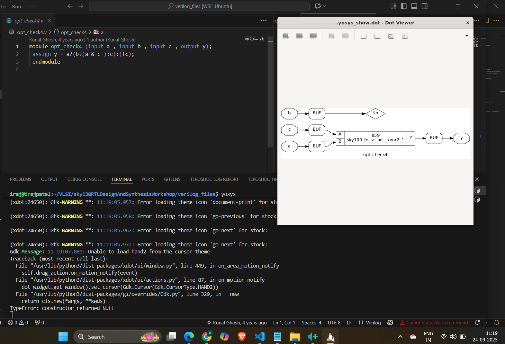
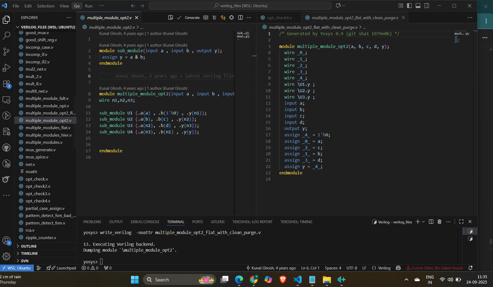
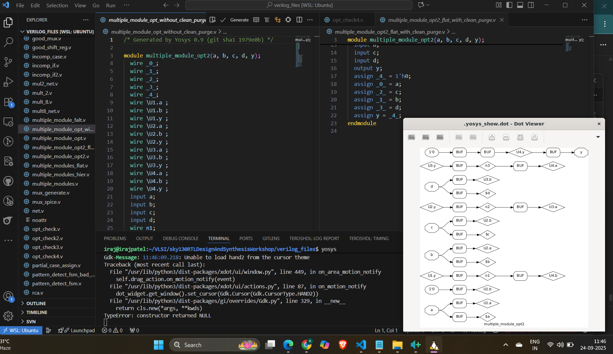
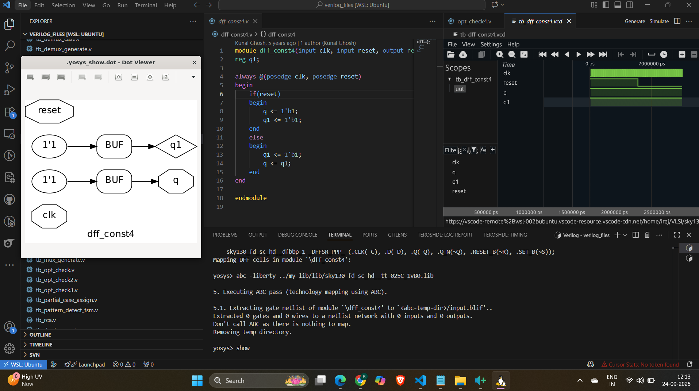
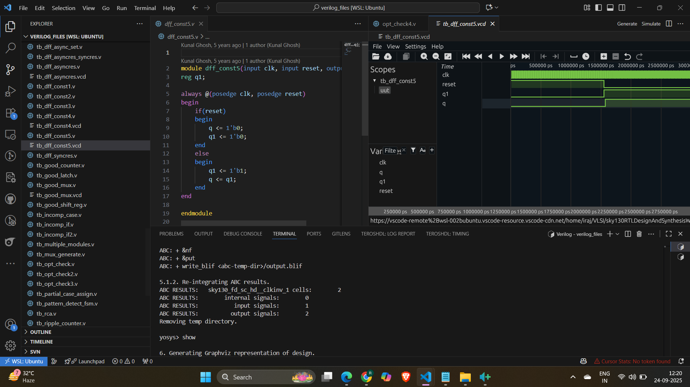
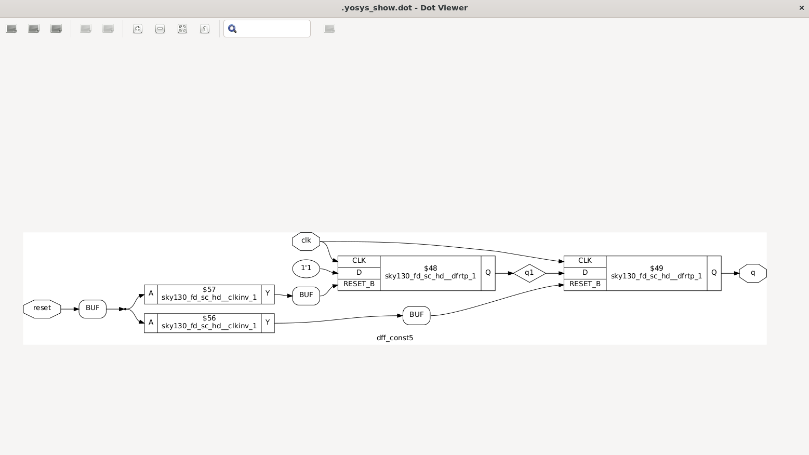
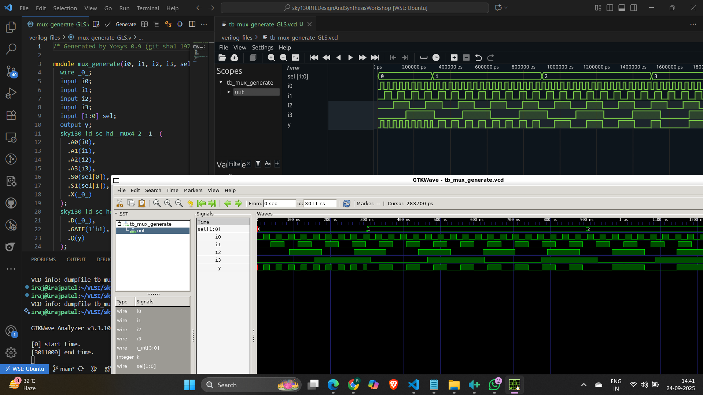
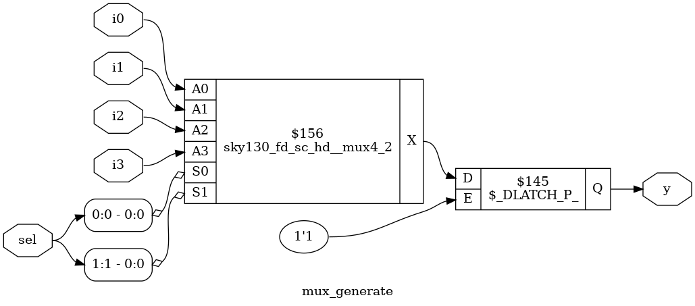
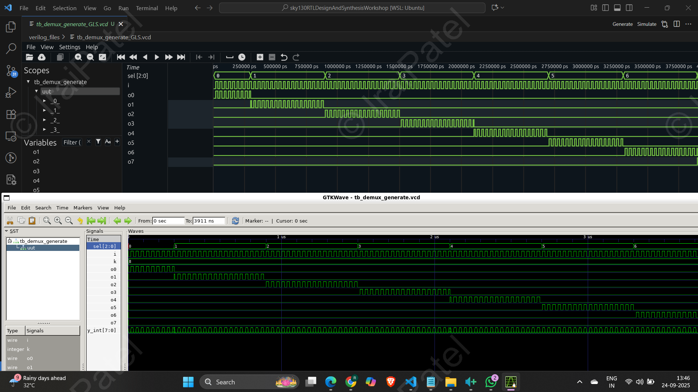
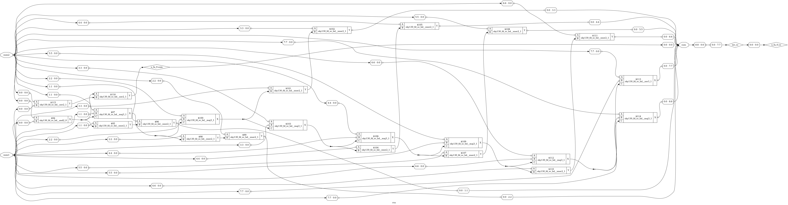

 
# 🚀 RTL-to-GLS Synthesis with Yosys and Iverilog

This project documents key concepts, Yosys flows, and practical experiments in **behavioral synthesis, hierarchical synthesis, flip-flop mapping, and optimization techniques** using standard cell libraries.

---

## 🎭 1. Behavioral Synthesis

* **What it is:**
  Converts behavioral Verilog (`always`, `if`, `case`) into RTL netlists (multiplexers, registers, FSMs).
* **Why important:**
  Bridges the gap between *high-level intent* and *actual hardware structures*.

---

## ⏱️ 2. Timing Basics

* **Setup Time (Tsetup):**
  Data must be stable *before* the clock edge. Violated if path delay is **too long**.
* **Hold Time (Thold):**
  Data must remain stable *after* the clock edge. Violated if path delay is **too short**.
* **Clock Frequency:**
  Determined by **critical path delay**.
* **Cell Choice Tradeoff:**

  * ⚡ Faster cells → better setup, worse hold, more power.
  * 🐢 Slower cells → better hold, less power, may fail setup.

---

## 📚 3. Liberty File (`.lib`)

* Stores **timing, power, functionality** of standard cells.
* Used for:

  * RTL → Gate mapping
  * Delay & power estimation
  * Flip-flop mapping with `dfflibmap`
* Note: Different libraries may define **different types of flops** (async reset, sync reset, enable, scan).

---

## 🏗️ 4. Hierarchical vs Flat Synthesis

| Mode                                      | Description                          | When to Use                                              |
| ----------------------------------------- | ------------------------------------ | -------------------------------------------------------- |
| **Hierarchical** (`synth -top submodule`) | Keeps module boundaries              | When submodule is instantiated many times (saves effort) |
| **Flat** (`synth_flat`)                   | Flattens into a single-level netlist | When global optimizations are needed                     |

---

## ⚡ 5. Stacked PMOS

* ❌ Stacking PMOS transistors increases resistance.
* 🚫 Leads to slower switching, degraded performance.

---

## 🔧 6. Submodule-Level Synthesis

* When reusing modules:

  ```tcl
  synth -top submodule_name
  ```

  → Synthesized once, reused across hierarchy.
* **Future Work 💡:**
  Stitch different synthesized modules via:

  * `hierarchy -libdir`
  * Linking gate-level netlists

---

## 🧩 7. Flip-Flops & Mapping Flow

Typical flow for mapping generic `$dff` to library flops:

```tcl
# Step 1: Load library
read_liberty -lib ../my_lib/lib/sky

# Step 2: Read design
read_verilog flop_name.v
synth -top flop_name

# Step 3: Map flip-flops
dfflibmap -liberty ../my_lib/lib/sky   # replaces $dff with real flops

# Step 4: Optimize
abc -liberty ../my_lib/lib/sky
```

---

## 📈 8. Optimization Experiments

### 🔹 Example 1: Multipliers (`mul2.v`, `mult_8.v`)

* Yosys applies:

  * Constant folding
  * Resource sharing
  * Gate-level simplification

---

### 🔹 Example 2: Constant Propagation (`opt_check.v`)


## 📝 9. Quick Command Reference

```tcl
# Load standard cell library
read_liberty -lib ../my_lib/lib/sky130_fd_sc_hd__tt_025C_1v80.lib

# Read Verilog
read_verilog design.v

# Synthesize top module
synth -top design

# Map flip-flops
dfflibmap -liberty ../my_lib/lib/sky130_fd_sc_hd__tt_025C_1v80.lib

# Optimize netlist
abc -liberty ../my_lib/lib/sky130_fd_sc_hd__tt_025C_1v80.lib
opt_clean -purge
```

---


Got it ✅ You want me to create a **structured `.md` file** (Markdown report) that organizes all your tasks (Task1–Task5, GLS theory, optimization, latches, blocking caveats, etc.), connects them logically, and makes it visually appealing with code blocks, sections, and icons.

I’ll prepare it like a **mini lab report**, where each task has:

* 📂 **Section title**
* 📜 **Explanation (theory + logic)**
* 💻 **Code snippet (iverilog/Yosys commands)**
* 📊 **Simulation Result (image placeholder)**
* ✅ **Observation/Conclusion**

Here’s a draft of how your `.md` file will look:

---

# 🚀 Yosys & Icarus Verilog Lab Report

## 📌 Task 1 – Yosys Optimization with `opt_clean -purge`

### 🔎 Objective

Understand how `opt_clean -purge` optimizes redundant nets in `opt_check4.v` and `multiple_module_opt.v`.

### 💻 Commands

```bash
yosys
read_verilog opt_check4.v
synth -top opt_check4
opt_clean -purge
show
```

```bash
yosys
read_verilog multiple_module_opt.v
synth -top multiple_module_opt
opt_clean -purge
show
```

### 📊 Results

* Before and after optimization with `opt_clean -purge`.






### ✅ Conclusion

`opt_clean -purge` removes unused logic and redundant nets, producing a simpler and more efficient design.

---


Got it 👍 You want me to take the **Test\_Synth.ys script and related tasks (2–5)**, and rewrite them in a **clear, structured, and proper way** so that it’s easy to follow what each step does, why it’s needed, and how GLS (Gate-Level Simulation) is performed.

Here’s the cleaned-up and well-structured explanation 👇

---

# 🔧 Yosys Synthesis & GLS Flow

## 📜 `Test_Synth.ys` Script Explanation

```tcl
# 1. Load the Sky130 liberty file (contains timing + logic info)
read_liberty -lib ../my_lib/lib/sky130_fd_sc_hd__tt_025C_1v80.lib

# 2. Load your RTL Verilog design
read_verilog mux_generate.v

# 3. Run generic synthesis
synth -top mux_generate

# 4. Flatten hierarchy (optional, removes module hierarchy)
flatten

# 5. Map flip-flops & latches to standard cells
dfflibmap -liberty ../my_lib/lib/sky130_fd_sc_hd__tt_025C_1v80.lib

# 6. Optimize the design by removing redundant logic
opt_clean -purge

# 7. Technology mapping using ABC (maps to Sky130 standard cells)
abc -liberty ../my_lib/lib/sky130_fd_sc_hd__tt_025C_1v80.lib

# 8. Remove unused cells/wires after mapping
clean

# 9. Optional: flatten hierarchy again
flatten

# 10. Write the final gate-level netlist
write_verilog -noattr mux_generate_GLS.v

# 11. Generate a schematic for visualization
show -format png -prefix mux_generate_show
```

---

## 📌 Task 2 – Constant DFF Mapping & GLS

### 🔎 Objective

Perform Yosys synthesis of constant-driven DFFs (`const4.v`, `const5.v`) and simulate using Icarus Verilog.

### 💻 Yosys Flow

```bash
yosys
read_liberty -lib sky130_fd_sc_hd__tt_025C_1v80.lib
read_verilog const4.v
synth -top const4
dfflibmap -liberty sky130_fd_sc_hd__tt_025C_1v80.lib
abc -liberty sky130_fd_sc_hd__tt_025C_1v80.lib
write_verilog const4_net.v
```

Repeat for `const5.v`.

### 💻 Icarus Verilog Flow

```bash
iverilog -o const4_sim const4.v tb_const4.v
vvp const4_sim
gtkwave dump.vcd
```

### 📊 Results





### ✅ Conclusion

* Constants are correctly propagated through DFF mapping.
* GLS validates functionality but timing is not modeled (since `.lib` models are not delay-annotated).

---

## 📌 Task 3 – MUX Using `for-generate`

### 💻 Simulation & Synthesis


```bash
yosys 
    yosys -s Test_Synth.ys
```

```bash
iverilog .../my_lib/verilog_models/primitives.v ../my_lib/verilog_models/sky130_fd_sc_hd.v mux_generate_GLS.v tb_mux_generate.v
```

### 📊 Results




### ✅ Conclusion

* RTL and GLS simulations match, proving structural correctness.
* `for-generate` provides scalable hardware design.

---

## 📌 Task 4 – DEMUX Using `generate`

### 💻 Commands


```bash
iverilog .../my_lib/verilog_models/primitives.v ../my_lib/verilog_models/sky130_fd_sc_hd.v demux_generate_GLS.v tb_demux_generate.v
```


### 📊 Results



### ✅ Conclusion

The demux functions correctly in both RTL and GLS simulations.

---

## 📌 Task 5 – Ripple Carry Adder (RCA)

### 💻 Simulation & Synthesis


```bash
iverilog .../my_lib/verilog_models/primitives.v ../my_lib/verilog_models/sky130_fd_sc_hd.v rca_GLS.v tb_rca.v
```

### 📊 Results




### ✅ Conclusion

* RCA shows expected behavior in GLS vs RTL simulations.
* Confirms correct synthesis of arithmetic circuits.

# 📘 Theory Notes (With Tables)

---

## ⏱️ Why Gate Level Simulation (GLS)?

| 🔎 Aspect        | 💡 Explanation                                                       |
| ---------------- | -------------------------------------------------------------------- |
| **Purpose**      | Validate synthesized netlist matches RTL functionality.              |
| **Timing check** | If delay info is available, GLS ensures timing requirements are met. |
| **Why needed**   | RTL sim = “intent”, GLS sim = “real hardware gates + flops”.         |
| **Without GLS**  | You risk simulation–synthesis mismatches going unnoticed.            |

---

## ⚡ Latch Inference & Sensitivity Issues

### Example 1 – Two Flops

```verilog
always @(*) begin
  q = q0;
  q0 = d;
end
```

| 🔎 Step               | 💡 Explanation                                          |
| --------------------- | ------------------------------------------------------- |
| **Execution order**   | `q` gets **old** `q0` first → then `q0` updated to `d`. |
| **Simulation effect** | `q` lags by one cycle vs `q0`.                          |
| **Synthesis effect**  | Needs storage for both old `q0` and new `q0`.           |
| **Result**            | Two flops (one for `q0`, one for `q`).                  |

---

### Example 2 – One Flop

```verilog
always @(*) begin
  q0 = d;
  q  = q0;
end
```

| 🔎 Step               | 💡 Explanation                                        |
| --------------------- | ----------------------------------------------------- |
| **Execution order**   | `q0` updated first, then `q` takes new value of `q0`. |
| **Simulation effect** | `q` and `q0` update together, no lag.                 |
| **Synthesis effect**  | Only one storage element for `q0`.                    |
| **Result**            | One flop total.                                       |

👉 **Rule of Thumb:** Blocking (`=`) causes sequential dependency, non-blocking (`<=`) avoids it.

---

## ⚠️ Blocking Caveat Example

```verilog
always @(*) begin
  d = x & c;
  x = a | b;
end
```

| 🔎 Step                | RTL Simulation View                              | Synthesis View           |            |
| ---------------------- | ------------------------------------------------ | ------------------------ | ---------- |
| **Order of execution** | `d` uses **old** value of `x`, then `x` updates. | Tools see \`d = (a       | b) & c;\`. |
| **Effect**             | `d` lags one cycle in sim.                       | `d` directly tied to \`a | b`and`c\`. |
| **Mismatch**           | Yes → sim ≠ synthesized hardware.                |                          |            |
| **Fix**                | Use non-blocking (`<=`) or reorder carefully.    |                          |            |

---

## 🔄 Incomplete `if` / `case` → Latch

```verilog
case(sel)
  2'b00: y = i0;
  2'b01: y = i1;
  // Missing 2'b10, 2'b11
endcase
```

| 🔎 Situation           | 💡 Explanation                                                         |
| ---------------------- | ---------------------------------------------------------------------- |
| **Missing assignment** | If `sel=10` or `11`, `y` not updated.                                  |
| **Hardware solution**  | Must “remember” old value of `y`.                                      |
| **Inference**          | Synthesis inserts a **latch**.                                         |
| **Problem**            | Latches are level-sensitive, harder for timing closure, cause hazards. |
| **Fix**                | Always cover all cases or add `default`.                               |

✅ Example fix:

```verilog
case(sel)
  2'b00: y = i0;
  2'b01: y = i1;
  2'b10: y = i2;
  2'b11: y = i3;
  default: y = 0;
endcase
```

---

## 📝 Key Lessons (Quick Table Recap)

| Concept                  | Bad Practice                        | Correct Practice                        |
| ------------------------ | ----------------------------------- | --------------------------------------- |
| Blocking assignments     | `q = q0; q0 = d;` (lag, 2 flops)    | Use proper order or use `<=`.           |
| Non-blocking assignments | —                                   | `q0 <= d; q <= q0;` (parallel updates). |
| Incomplete case/if       | Leaves signal unassigned → latch    | Add `default` or cover all cases.       |
| GLS necessity            | RTL ≠ Synthesis (possible mismatch) | GLS confirms functional equivalence.    |

---


