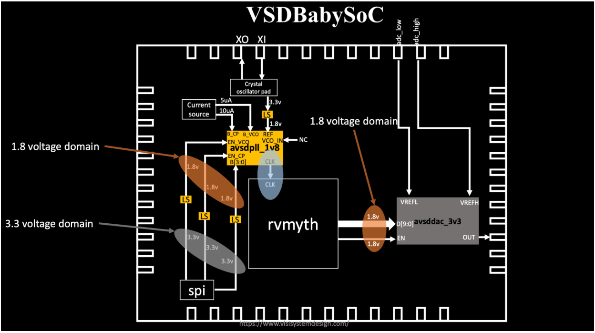
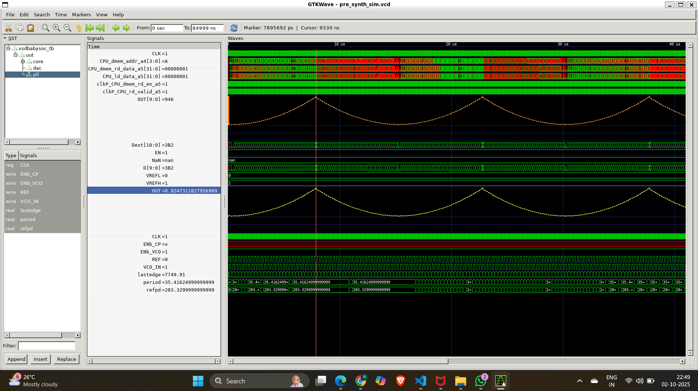

# 🌟 Fundamentals of System-on-Chip (SoC) Design  
---

## 🧐 What is a System-on-Chip (SoC)?  

> ⚡ **A System-on-Chip (SoC) = an entire computer on a single chip!**  
It combines **CPU, memory, I/O, GPU, DSP, and connectivity** into one tiny package.  

🎯 **Why SoCs?**  
- 📦 Compact → Fits in your phone, watch, IoT device  
- 🔋 Efficient → Consumes less power  
- ⚡ Fast → Shorter data travel = faster processing  
- 💰 Cost-effective → One chip instead of many  

---

## 🧩 Key Components of an SoC  

| 🔧 Component | 📝 Function |
|--------------|------------|
| 🖥 **CPU** | Executes instructions, performs calculations |
| 💾 **Memory (RAM/ROM/Flash)** | Temporary & permanent data storage |
| 🔌 **I/O Ports** | Communicates with peripherals (USB, Camera, Sensors) |
| 🎮 **GPU** | Handles graphics, visuals, and gaming |
| 🎵 **DSP** | Processes signals (audio/video) |
| 🔋 **Power Mgmt.** | Optimizes energy usage |
| 📡 **Connectivity** | Wi-Fi, Bluetooth, Security modules |

💡 **Analogy**: Think of SoC as a **mini-city 🏙️** →  
- CPU = City Hall 🏛️  
- Memory = Library 📚  
- I/O = Roads & Highways 🛣️  
- GPU = Art District 🎨  
- DSP = Concert Hall 🎼  
- Power Mgmt. = Power Station ⚡  

---

## 🔥 Types of SoCs  

<details>
<summary>🔧 Microcontroller-based SoC</summary>
💡 Designed for **simple control tasks** (appliances, IoT).  
✅ Low power, efficient, small.  
</details>

<details>
<summary>⚡ Microprocessor-based SoC</summary>
💡 Runs **OS & heavy tasks** (smartphones, tablets).  
✅ High performance, multitasking.  
</details>

<details>
<summary>🎯 Application-Specific SoC</summary>
💡 Tailor-made for **specific domains** → AI 🧠, graphics 🎮, networking 🌐.  
✅ Optimized speed & efficiency.  
</details>  

---

## 🌀 The SoC Design Flow  

```mermaid
graph LR
    A[📘 Specification] --> B[📝 Functional Modelling]
    B --> C[💻 RTL Design]
    C --> D[⚙️ Verification & Simulation]
    D --> E[🏭 Physical Design]
    E --> F[📦 Fabrication & Testing]
````

---

## 👶⚡ VSDBabySoC – A Tiny but Powerful RISC-V SoC


### 🌟 Introduction

**VSDBabySoC** is a **compact RISC-V-based SoC** that integrates:

* 🧠 **RVMYTH Core** – a simple educational CPU based on RISC-V
* ⏱️ **8x PLL** – generates a stable clock
* 🎚 **10-bit DAC** – interfaces with analog devices

👉 The goal? To **test multiple open-source IPs together** and **calibrate analog parts** in an educational SoC built on **Sky130 technology**.



---

### ❓ What is VSDBabySoC?

✨ A **hands-on learning platform** that demonstrates how a **CPU, PLL, and DAC** come together in one **tiny SoC**.

* **RVMYTH** 🧠 → RISC-V CPU Core
* **PLL** ⏱️ → Stable clock generation
* **DAC** 🎚 → Converts digital → analog for external devices

🎯 **Purpose**:
To **integrate open-source IPs** + **explore digital-analog interfacing** → output signals for **audio/video devices** like TVs & mobile phones.

---

### 📘 Quick Recap of Core Concepts

#### 🧩 What is SoC?

A **System-on-Chip** is a **single-die chip** with multiple IP cores (CPU → Modems → DACs).

#### 🧠 What is RVMYTH?

A **RISC-V educational CPU core** – simple, lightweight, perfect for student learning.

#### ⏱️ What is PLL?

A **Phase-Locked Loop** → generates precise, stable clock signals by syncing with input phase.

#### 🎚 What is DAC?

A **Digital-to-Analog Converter** → bridges digital cores with analog devices.

---

## 📂 Project Structure

```txt
VSDBabySoC/
├── src/
│   ├── include/      # Header files (*.vh)
│   ├── module/       # Verilog + TLV modules
│   │   ├── vsdbabysoc.v   # Top-level module
│   │   ├── rvmyth.v       # CPU
│   │   ├── avsdpll.v      # PLL
│   │   ├── avsddac.v      # DAC
│   │   └── testbench.v    # Testbench
└── output/           # Simulation outputs
```

---

## 🛠️ Setup

### 📥 Cloning the Project

```bash
cd ~/VLSI
git clone https://github.com/manili/VSDBabySoC.git
cd VSDBabySoC/
```

📂 You’ll see:

* `src/` (modules)
* `images/` (visuals)
* `output/` (simulation results)

---

## 🔧 TLV → Verilog Conversion

Since **RVMYTH** is written in **TL-Verilog (.tlv)**, we need to convert it to Verilog before simulating.

```bash
# Install tools
sudo apt update
sudo apt install python3-venv python3-pip

# Create virtual env
python3 -m venv sp_env
source sp_env/bin/activate

# Install SandPiper-SaaS
pip install pyyaml click sandpiper-saas

# Convert TLV → Verilog
sandpiper-saas -i ./src/module/*.tlv -o rvmyth.v --bestsv --noline -p verilog --outdir ./src/module/
```

✅ Now you’ll have `rvmyth.v` alongside your other Verilog files.

---

## 🧪 Simulation Flow

### 🔹 Pre-Synthesis Simulation

```bash
mkdir -p output/pre_synth_sim

iverilog -o output/pre_synth_sim/pre_synth_sim.out \
  -DPRE_SYNTH_SIM \
  -I src/include -I src/module \
  src/module/testbench.v

cd output/pre_synth_sim
./pre_synth_sim.out
```

📊 View in GTKWave:

```bash
gtkwave output/pre_synth_sim/pre_synth_sim.vcd
```

### 🔍 Signals to Observe

* ⏱️ **CLK** → Input clock (from PLL)
* 🔄 **reset** → Reset signal
* 🎚 **OUT (DAC)** → Output from DAC (appears digital in sim)
* 🔢 **RV_TO_DAC[9:0]** → 10-bit RVMYTH output → DAC input

---

## 🎯 RISC-V CPU (`rvmyth`) System Overview

The CPU executes a program that updates **register `r17`**.
The value in `r17` is continuously sent to the DAC, which converts it into a proportional analog voltage.

**Data Flow:**
Instruction Memory → CPU Pipeline → Register r17 → DAC → Analog OUT

---

## 📝 Instruction Program

The CPU runs a small program (13 instructions). The goal:

1. Increment counters,
2. Accumulate values into `r17`,
3. Oscillate them to generate analog waveforms,
4. Hold in a final loop.

| #  | Instruction         | Action                  |
| -- | ------------------- | ----------------------- |
| 0  | `ADDI r9, r0, 1`    | r9 = 1 (decrement step) |
| 1  | `ADDI r10, r0, 43`  | r10 = 43 (loop limit)   |
| 2  | `ADDI r11, r0, 0`   | r11 = 0 (counter)       |
| 3  | `ADDI r17, r0, 0`   | r17 = 0 (DAC input)     |
| 4  | `ADD r17, r17, r11` | Accumulate into r17     |
| 5  | `ADDI r11, r11, 1`  | Increment counter       |
| 6  | `BNE r11, r10, -4`  | Repeat until r11=43     |
| 7  | `ADD r17, r17, r11` | r17 += r11              |
| 8  | `SUB r17, r17, r11` | r17 -= r11              |
| 9  | `SUB r11, r11, r9`  | r11--                   |
| 10 | `BNE r11, r9, -4`   | Loop until r11=1        |
| 11 | `SUB r17, r17, r11` | Final adjust            |
| 12 | `BEQ r0, r0, ...`   | Infinite loop           |

---

## 🔄 Execution Timeline

| Phase                   | Registers  | r17 Value          | Behavior           |
| ----------------------- | ---------- | ------------------ | ------------------ |
| **Ramp (Loop1)**        | r11 = 0→42 | r17 = Σ0..42 = 903 | Monotonic increase |
| **Peak**                | r11 = 43   | r17 = 946          | Transient maximum  |
| **Oscillation (Loop2)** | r11 = 43→1 | r17 = 903 ± r11    | Oscillating decay  |
| **Final**               | r11 = 1    | r17 adjusted       | Holds steady       |

---


## 📈 Pre_synth_sim Waveform



## ⚡Observation  (CPU → DAC Connection)

### CPU Side (`rvmyth.v`)

* Register file write:

```verilog
OUT = CPU_Xreg_value_a5[17]; // r17 drives DAC
```

* The CPU pipeline ensures r17’s **committed value** is sent each cycle.

---

### DAC Side (`avsddac.v`)

Digital input → Analog conversion:

```verilog
OUT <= VREFL + ($itor(Dext) / 1023.0) * (VREFH - VREFL);
```

| Term    | Meaning                |
| ------- | ---------------------- |
| `Dext`  | Input (r17) extended   |
| `VREFH` | High reference voltage |
| `VREFL` | Low reference voltage  |
| `OUT`   | Analog output voltage  |

$V_{\mathrm{OUT}} = \frac{r_{17}}{1023} \times (V_{\mathrm{REFH}} - V_{\mathrm{REFL}})$

### ⚖️ **Numerics for DAC conversion**

##### scaling:

$$
V_{OUT} = \frac{r_{17}}{1023} \times V_{REF\_SPAN}
\quad (\text{with } V_{REF\_SPAN} = 1.0\ \text{V})
$$


##### For **r17 = 903**:

$$
V_{OUT} = \frac{903}{1023} \times 1.0
= 0.88221\ \text{V}
$$


##### For the peak **r17 = 946**:

$$
V_{OUT} = \frac{946}{1023} \times 1.0
= 0.92502\ \text{V}
$$


##### 📊 Example Output Values (VREF = 1.0 V)

| r17 Value  | DAC Output Voltage |
| ---------- | ------------------ |
| 903        | 0.882 V            |
| 946 (peak) | 0.925 V            |


👉 Switch `OUT` format → **Analog Step** in GTKWave for DAC output visualization.

---

## 🛠️ Troubleshooting

* ⚠️ **Module Redefinition** → Ensure files are included only once.
* 🛤 **Path Issues** → Use absolute paths if relative ones fail.
* ⏱️ **Waveform Mismatch** → Verify proper GTKWave format selection.

---

## 🎯 Final Takeaway

* **VSDBabySoC** = A **mini educational RISC-V SoC** integrating CPU + PLL + DAC.
* 🎓 Built for **students & open-source chip enthusiasts** to understand **SoC design, verification, and digital-analog interfacing**.
* 🛠️ Demonstrates **pre/post-synthesis simulations** using open-source tools on **Sky130 tech**.

💡 BabySoC isn’t just a project — it’s a **sandbox for future chip designers 🚀**.


## 📚 Resources

* 🔗 [RISC-V Core – Shivani Shah](https://github.com/shivanishah269/risc-v-core)
* 📘 [SoC Fundamentals – Hemanth Kumar](https://github.com/hemanthkumardm/SFAL-VSD-SoC-Journey/blob/main/11.%20Fundamentals%20of%20SoC%20Design/README.md)
* 🛠 [VSD SoC Journey – Spatha (Day 5)](https://github.com/spatha0011/spatha_vsd-hdp/tree/main/Day5)
* 🌱 [VSDBabySoC – Manili](https://github.com/manili/VSDBabySoC)


